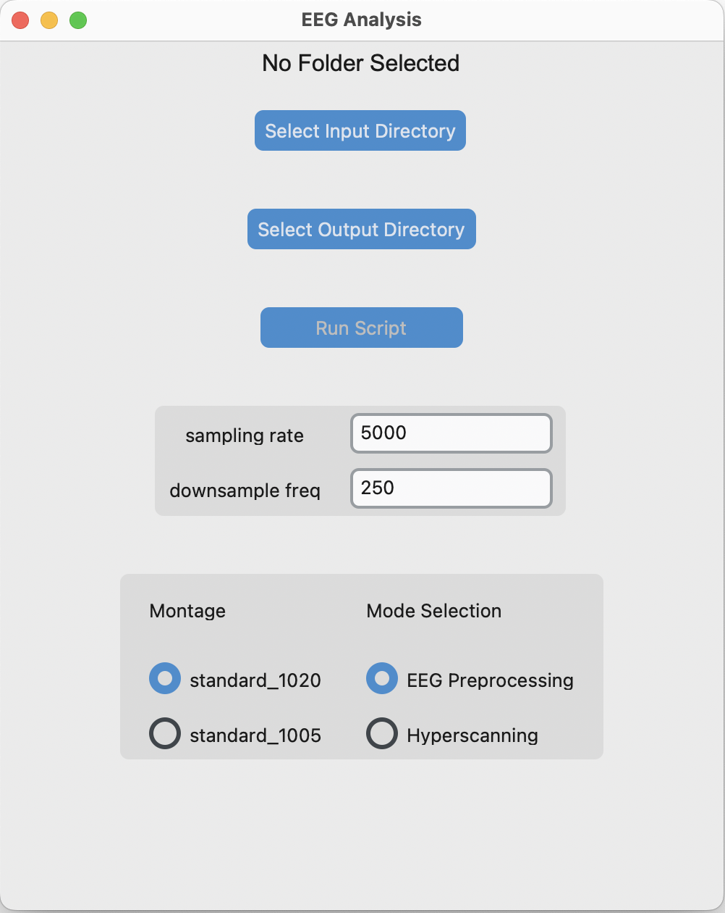

# Hyperscanning Project
Hyperscanning is a neuroimaging experiment where brain activity of two or more participants are recorded under same interaction/stimulus.  
Different tools can be used to measure the inter-brain synchrony (how brain/neural activity/wave of participants align during various interactions). One way of measuring is by calculating the Phase Locking Value (PLV), values between 0 and 1. 
This repository contains an automated EEG preprocessing pipeline for cleaning & removing artifacts, detecting bad ch from the raw EEG signals, and performing PLV analysis on the cleaned signals.  


This preprocessing script relies heavily on MNE-Python for most of the EEG related operations.  
For users that are comfortable working with EEG signals or have some experience with coding, feel free to explore the preprocessing.py and tailor it to your needs (This is the most recommended approach).

For users that have no programming experiences or just want to preprocess some EEG signals, check out the default GUI that comes with the code.  
More updates will be made to this repository, but for users that don't want to edit the code, please take a look at the recommended directory structure & file naming convention.  

## Preprocessing
### The preprocessing steps are as follows
* **Crop Signal**  
For signals with mne annotations, the method "crop_signal" correctly crops the signal as per annotation.   
Make sure to edit the crop_signal method as the strings used for the annotation is hard coded in the current version.  
* **Set Montage**  
For users editing the preprocessing.py this part can be ignored but for GUI users, there are only two options.    
&emsp;* standard_1020  
&emsp;* standard_1005  
* **Filtering**  
This method performs zero-phase FIR Filter default (0.5~45hz) with notch filter at 60hz.  
For details please check the filter_signal() method
For detecting the bad signal/channel, after the filtering, the method automatically plots all EEG channels and corresponding PSD.  
(Reminder, include autoreject_bads_ch here? and remove bad channel from both pA, pB?)
* **Artifact Removal**  
As the name suggests, the ica_remove_HVEOG() method will use the HEOG, VEOG recording to remove ocular artifacts from the EEG signals.  
For users that don't have the HEOG&VEOG signals, remove this line in the main(). Or if EOG channels are included in the recording, but have different name (ex. EOG, VEO, HEO), change the strings used in ica_remove_HVEOG() method.  
Don't confuse ica_remove_HVEOG() with remove_artifacts(). This method doesn't require additional signals as it uses mne-ICALabel (pre-trained model for detecting artifacts) on the EEG signals and removes any artifacts that are above the threshold (chance of being artifact > 80%). 
For users that don't have HEOG & VEOG signals use remove_artifacts() instead.  However, this method is not recommended in most cases.  
* **Rereferencing**  
Re-reference to 'average' referencing by default  
Change the arguments for the set_reference() method for other referencing options.    
* **Epoching**  
By default, generates 10s epoch and applies autoreject to remove any bad epoch
Finally, the user can view the saved mne.Report to verify every preprocessing steps and check the quality of the signals before/after at any steps.  
(Reminder, for Hyperscanning push the Epoch step for later as autorejecting same epochs for pA&pB can be done using hypyp)

* **Under Testing**  
New method "autoreject_bads_ch" is now added under autoreject_bads.py.
It looks at the standard deviation of the psd of all channels from the mean psd and if it is zscore_threshold away from the mean,  
it is marked as bad automatically. In addition, the method also calculates the peak-to-peak value of all the channels (lower bound: 5e-6, upper bound: 500e-6).     

## Folder Structure & File names
The following is required for users that don't want to change the default code.  
The default code relies on specific folder name & file names.  
```text
Hyperscanning/
├── d01/
│   ├── projname_d01_pA.mff
│   └── projname_d01_pB.mff
├── d02/
│   ├── projname_d02_pA.mff
│   └── projname_d02_pB.mff
├── ...
│   ├── ...
│   └── ...
├── Reports
│   ├── d01/
│   ├── d02/
│   ├── .../
└── 
```
As hyperscanning requires two or more synchronous recordings, the folder is structured in a way where the participants from same recording are stored in the same (dyad) folder.  
For saving the file, make sure to use   
```
(any name)_(which dyad they belong to)_(which participant (A or B))
```
After the preprocessing, the cleaned signals will be saved under the same dyad folder where the raw signal was loaded from & the mne.Report will be saved to Reports/(correct dyad folder)/  
## GUI
Download all the required dependencies  
Run the following command in the terminal  
For mac users
```bash
python3 eeg_gui.py
```
For windows users
```bash
python eeg_gui.py
```
After selecting the input and output directory, click on the run button and chosen mode will execute. The following is what should appear on the screen upon successful execution of the GUI.  
  
Intended usage for the GUI:  
Run preprocessing first, then indicate the input and output dir for hyperscanning analysis and pick the hyperscanning mode then run the script.  

## Dependencies
All of required packages to create the environment are under env folder.  
To create the conda env, run the following command in the terminal (make sure to have miniconda or conda installed).  
```bash
conda env create -f environment.yml
pip install -r requirements.txt
```
Make sure when running this command, the user is under env directory!  


(Reminder: Why is the image so big??, fix preprocessing for hyperscan load two files & simultaneous edits)